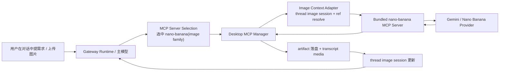

# 系统内置 Image MCP（Thread-first / Nano Banana，v0.1）

> 目标：把 Crab 的对话式图片生成/编辑做成**系统内置 MCP Server**，对齐现有 `Desktop 执行 + Gateway 编排 + thread-first` 架构，而不是再造一条 chat tool / skill / 页面外挂旁路。

> 本 spec 基于以下一手源码调研：
> - `docs/research/builtin-image-mcp-benchmark-2026-03-25.md`
> - `ErlichLiu/Proma`
> - `gemini-cli-extensions/nanobanana`
> - `YCSE/nanobanana-mcp`
> - `zhongweili/nanobanana-mcp-server`

---

## 0. 结论先行

v0.1 的目标形态：

1. **新增系统内置 bundled MCP server：`nano-banana`**
2. **主对话继续走多 provider，图像执行层先固定 Gemini / Nano Banana**
3. **新增 MCP family：`image`**
4. **对主模型默认只暴露两个工具：**
   - `mcp.nano-banana.generate_image`
   - `mcp.nano-banana.edit_image`
5. **新增 thread 级持久化 `imageSessionV1`**
   - 保存 thread 的图片历史、最近 artifact、默认参数
6. **新增进程内易失 `providerSessionCache`**
   - 保存 Gemini 连续编辑需要的 provider 原生上下文
7. **MCP 返回的图片结果必须进入 Crab 的结构化 artifact / transcript**
   - 压缩前允许显示工具日志
   - 压缩后保留图片与最终对话内容，不依赖工具日志续跑

一句话：

**先做“多模型指挥，一个内置 MCP 负责出图/改图”的 thread-first 图像系统。**

---

## 1. 设计目标

### 1.1 要解决的问题

当前 Crab 已有：

- 图片输入
- transcript 媒体渲染
- MCP server-first 选择
- Desktop 本地执行 MCP

但还没有：

- 系统内置图像执行 MCP
- 对话内连续改图
- 图片 artifact 的 thread 级续跑语义

### 1.2 成功标准

用户可以直接在对话里说：

- “给我生成一张极简科技感封面图，16:9”
- “把刚才那张图里的背景换成纯白”
- “保持人物一致，再来一张半身图”
- “看我上传这张图，帮我修成更像真实拍摄”

系统应做到：

1. 主模型自己决定是否调用图像 MCP
2. 图片结果直接回流当前 thread
3. 下一轮可以继续基于上一张图修改
4. 重启应用后，至少还能基于已保存 artifact 继续编辑

### 1.3 非目标

v0.1 不做：

- 多个图片执行 provider 的自动路由
- 页面级图片工作台
- 通用图像工作流编排器
- 模型直接管理 provider 的 `conversation_id`
- 把 `maintenance / set_model / set_aspect_ratio` 这类运维工具暴露给主模型

---

## 2. 为什么必须做成系统内置 MCP

不选 chat tool / skill / 独立功能页的原因：

### 2.1 不选 chat tool

chat tool 会走另一条并行执行链，容易绕开现有：

- MCP server-first 选择
- capability card
- tool retrieval
- MCP 连接状态与诊断
- Settings 里的统一 server 管理

这会把“图像执行”做成体系外特例。

### 2.2 不选 skill

skill 适合流程、规则、编排，不适合承载底层图像执行器。
图像生成本质上是一个可连接、可配置、可诊断、可返回媒体 artifact 的 execution backend，更接近 MCP server。

### 2.3 不选独立页面

产品范式已经明确：

- 打开就是对话
- 一切在对话里发生

图片生成/编辑也必须服从这个范式。

### 2.4 与现有架构天然同构

当前 Crab 已有的主线正适合这件事：

- Desktop bundled MCP server
  - 参考：`apps/desktop/electron/mcp-manager.mjs`
- Gateway server-first MCP 选择
  - 参考：`apps/gateway/src/agent/toolCatalog.ts`
- capability card + context summary
  - 参考：`apps/gateway/src/agent/capabilityIndex.ts`
  - 参考：`apps/gateway/src/agent/contextAssembler.ts`
- MCP 调用结果支持 image content 落盘
  - 参考：`apps/desktop/electron/mcp-manager.mjs`

所以正确方向不是“加一个生图功能”，而是：

**新增一个系统内置 Image MCP family。**

---

## 3. 方案总览



核心原则：

1. thread 是事实源
2. provider session 只是优化层
3. 图片结果必须回到 thread
4. 主模型只看简洁工具面，不背 provider 细节

---

## 4. 运行时分层

## 4.1 三层责任

### A. 主对话层（任意 provider）

负责：

- 理解用户意图
- 看图与追问
- 写/改英文 prompt
- 决定是否继续修图

不负责：

- 直接调用 Gemini 原生接口
- 管理 provider session id

### B. 图像执行层（v0.1 固定 Gemini）

负责：

- 文生图
- 基于参考图编辑
- 连续编辑
- 模型选择（如 `nb2 / pro`）
- 图片输出与文件落盘

### C. Thread 状态层（Crab 自己维护）

负责：

- 当前 thread 的图片历史
- 最近可编辑 artifact
- 最近一轮用户上传图片索引
- 压缩后续跑所需的最小图像状态

---

## 5. Server 身份与配置

## 5.1 新增内置 server

新增 built-in bundled MCP server：

- `serverId`: `nano-banana`
- `name`: `Nano Banana 图像生成与编辑`
- `familyHint`: `image`
- `toolProfile`: `image_generation_minimal`
- `transport`: `stdio`
- `bundled`: `true`

建议入口文件：

- `apps/desktop/electron/mcp-servers/nano-banana.mjs`

对应 Desktop 内置 server 列表：

- 修改 `apps/desktop/electron/mcp-manager.mjs`

## 5.2 配置项

v0.1 暴露以下配置字段：

- `GEMINI_API_KEY`（复用仓库已有的 Google/Gemini key，与 LLM 模型用的是同一个）
- `GEMINI_BASE_URL`（可选，支持代理/聚合 API）
- `NANOBANANA_DEFAULT_MODEL`（可选，默认 `gemini-3.1-flash-image-preview`）
- `NANOBANANA_PRO_MODEL`（可选，默认 `gemini-3-pro-image-preview`）
- `NANOBANANA_DEFAULT_TIER`（可选，默认 `nb2`）
- `modelNameOverride`（可选，聚合 API 模型名映射，如 `{"flash": "custom-flash-name", "pro": "custom-pro-name"}`）

### 5.2.1 API 端点

| 模型 | endpoint |
|------|----------|
| `gemini-3.1-flash-image-preview`（默认） | `/v1beta/models/gemini-3.1-flash-image-preview:generateContent` |
| `gemini-3-pro-image-preview` | `/v1beta/models/gemini-3-pro-image-preview:generateContent` |

默认使用 flash 模型（速度快、成本低），`quality=high` 时切换到 pro。

### 5.2.2 Key 来源

`GEMINI_API_KEY` 与仓库已有的 Google/Gemini LLM 模型共用同一个 key——不需要用户额外配置。
server 启动时从以下优先级读取：
1. MCP server config 中的显式配置
2. Gateway DB 中已有的 Gemini 模型 apiKey（通过 aiConfig 解密）
3. 环境变量 `GEMINI_API_KEY`

要求：

1. server 默认作为 built-in 存在
2. 未配置 API key 时：
   - 在 Settings 中可见
   - 不进入可执行工具池
   - 状态标成 `needs_auth` / `error` 风格摘要
3. 配置后支持热连接与重连

## 5.3 为什么 serverId 先用 `nano-banana`

v0.1 先明确 provider 执行层就是 Gemini / Nano Banana。
后续如果要加：

- `gpt-image`
- `imagen`
- `flux`

再并列新增其它 image family server 即可。

不在 v0.1 里强行做 provider-neutral `image-gen` 抽象，避免第一版协议空泛。

---

## 6. 新增 MCP family 与 tool profile

## 6.1 family 枚举扩展

以下位置新增 `image` family：

- `apps/gateway/src/agent/toolCatalog.ts`
- `apps/gateway/src/agent/capabilityIndex.ts`
- `apps/desktop/electron/mcp-manager.mjs`
- `apps/desktop/src/state/mcpStore.ts`
- `apps/desktop/src/ui/components/SettingsModal.tsx`

family 语义：

- `image`: 图片生成、编辑、修图、保持风格/角色一致性

## 6.2 tool profile

新增：

- `image_generation_minimal`

agent-visible 默认只暴露：

- `generate_image`
- `edit_image`

可保留但不对主模型默认暴露的附属工具：

- `get_image_history`
- `clear_image_history`
- `debug_image_session`

这样做的原因：

- 主模型只看最小工具面，减少误用
- 调试/QA 仍可通过 Settings 或手工调用看到会话状态

---

## 7. Tool 合同

## 7.1 agent-facing 工具面

### `generate_image`

用途：

- 纯文生图
- 基于 thread 历史保持风格/角色一致
- 基于用户上传图片做参考式生成

建议 schema：

```ts
type GenerateImageArgs = {
  prompt: string;
  aspectRatio?: "1:1" | "4:3" | "3:4" | "16:9" | "9:16" | "21:9";
  quality?: "auto" | "fast" | "high";
  useThreadHistory?: boolean;
  referenceImages?: string[]; // 允许 "last_generated" / "last_user_image" / "artifact:<id>" / abs path
};
```

### `edit_image`

用途：

- 修改当前 thread 里最近一张图
- 修改用户上传图片
- 修改指定 artifact

建议 schema：

```ts
type EditImageArgs = {
  target: string; // "last" | "last_generated" | "last_user_image" | "artifact:<id>" | abs path
  editPrompt: string;
  aspectRatio?: "1:1" | "4:3" | "3:4" | "16:9" | "9:16" | "21:9";
  quality?: "auto" | "fast" | "high";
  referenceImages?: string[];
};
```

## 7.2 不直接暴露给模型的 provider 细节

以下字段不应成为主模型公开 schema：

- `conversation_id`
- `output_path`
- `file_id`
- `model_tier`
- `thinking_level`
- `enable_grounding`

这些都应由 Desktop runtime 或 server 内部决定。

## 7.3 内部实现可保留的扩展参数

server 内部可以支持：

- `resolvedReferenceImagePaths`
- `threadId`
- `providerTier`
- `providerSessionKey`
- `returnFullImage`

但这些不是 model-visible schema。

---

## 8. Thread-first 图像上下文合同

## 8.1 新增 thread 持久态：`imageSessionV1`

在 thread 结构中新增：

```ts
type ThreadImageArtifactRef = {
  artifactId: string;
  path?: string;
  source: "generated" | "edited" | "user_upload";
  createdAt: string;
  prompt?: string;
  aspectRatio?: string;
  mimeType?: string;
};

type ThreadImageSessionV1 = {
  v: 1;
  lastGeneratedArtifactId?: string | null;
  lastEditedArtifactId?: string | null;
  recentArtifacts: ThreadImageArtifactRef[];
  defaultAspectRatio?: string | null;
  preferredProvider?: "gemini_nb";
  updatedAt: string;
};
```

挂载位置建议：

- `packages/shared/src/runtime/thread-turn-item.ts`
  - 为 `ThreadRecord` 新增 `imageSession?: ThreadImageSessionV1 | null`
- `threadSnapshotHint` 同步新增 `imageSession`

## 8.2 为什么要单独持久化 `imageSessionV1`

因为它解决了两个问题：

1. 工具日志压缩后，thread 仍知道“最近可编辑的是哪张图”
2. 应用重启后，即使 provider 原生会话丢了，也还能从 artifact 继续改图

## 8.3 进程内易失态：`providerSessionCache`

Desktop main process 额外维护：

```ts
type ProviderImageSessionCache = {
  threadId: string;
  provider: "gemini_nb";
  rawHistory?: unknown[]; // provider 原生多轮 parts / thoughtSignature
  lastUsedAt: number;
};
```

特点：

- 仅用于提升连续改图成功率
- 可丢失
- 不写入 conversation 持久文件

## 8.4 冷启动 / provider cache 丢失时的降级

如果 `providerSessionCache` 不存在：

1. 从 `thread.imageSessionV1.recentArtifacts` 找最近图像
2. 将最近图像作为 reference image 重新构造上下文
3. 继续执行编辑

这保证：

- 重启后仍能续改
- 不会因为 provider 内存态丢失而整条链断掉

---

## 9. 图像引用解析合同

## 9.1 模型可见的引用语法

v0.1 支持：

- `last`
- `last_generated`
- `last_user_image`
- `artifact:<id>`
- 绝对路径（仅助手模式可保留）

## 9.2 运行时解析，不让 server 自己猜 thread

新增一个 `Image Context Adapter`，位置建议在 Desktop 侧：

- `apps/desktop/src/agent/wsTransport.ts`
- 或 `apps/desktop/electron/mcp-manager.mjs` 前的一层 helper

职责：

1. 读取当前 thread / run 的 `imageSessionV1`
2. 解析 `last` / `artifact:<id>`
3. 合并本轮用户上传图片
4. 产出 provider 可直接消费的绝对路径数组

## 9.3 解析优先级

### 对 `edit_image.target`

优先级：

1. `artifact:<id>`
2. `last`
3. `last_generated`
4. `last_user_image`
5. 绝对路径

### 对 `referenceImages[]`

逐项解析，忽略失败项，但在 tool result 的 text summary 里写 warning。

---

## 10. 图片 artifact 与 transcript 合同

## 10.1 返回值要求

MCP server 返回：

- 至少一个 `image` content block
- 一个 `text` summary block

## 10.2 Desktop 落盘要求

现有 `mcp-manager` 已支持把 `image` block 落到：

- `userData/mcp-artifacts/<toolName>/...`

v0.1 要进一步增强：

### 当前现状

- `mcp-manager` 会把 inline image 落盘
- 并把文本里的 markdown link 重写成 file-ref

### v0.1 新要求

`mcpManager.callTool()` 除现有 `output` 外，还应返回结构化 artifact：

```ts
type McpToolArtifact = {
  absPath: string;
  href: string;
  mimeType: string;
  previewKind: "image";
  name?: string;
};
```

返回形态建议：

```ts
{
  ok: true,
  output: "...",
  artifacts: McpToolArtifact[],
  diag?: ...
}
```

## 10.3 wsTransport / transcript 接入

以下链路需要更新：

- `apps/desktop/src/agent/wsTransport.ts`
- `apps/desktop/src/agent/transcript.ts`
- `apps/desktop/src/ui/components/ChatArea.tsx`
- `apps/desktop/src/components/ToolBlock.tsx`

要求：

1. 工具卡能显示生成图片 artifact
2. assistant transcript 要直接拥有 `image` part，而不只是文本链接
3. conversation snapshot / history 恢复时要保留图片消息 part

## 10.4 压缩策略

当发生 compact / history trim 时：

- 可以删除工具调用明细
- 但必须保留：
  - assistant 最终文字
  - assistant 图片 part
  - thread.imageSessionV1

这样后续“再改上一张图”仍可成立。

---

## 11. Gateway 选择与能力暴露

## 11.1 新 capability 关键词

在 `apps/gateway/src/agent/toolCatalog.ts` 增加图像意图关键词：

- 生图
- 画图
- 配图
- 封面图
- 海报
- 插画
- 修图
- 改图
- 换背景
- 抠图
- 保持人物一致
- 风格一致
- character consistency
- image generation
- image edit

建议新增 capability：

- `image_generate`
- `image_edit`

## 11.2 MCP family 选择

`selectMcpServerSubset()` 增加对 `image` family 的评分：

- prompt 命中 `image_generate` / `image_edit` 时优先保留 `nano-banana`
- `image` family 视为 `stateful`

## 11.3 capability card

`apps/gateway/src/agent/capabilityIndex.ts` 增加：

- `image` family title：`图像生成/编辑`
- summary：`根据文字描述生成图片，或基于当前线程图片继续修图、保持风格一致。`
- examples：
  - `生成封面图`
  - `改刚才那张图`
  - `保持人物一致再出一张`

## 11.4 Context Assembler 摘要

`apps/gateway/src/agent/contextAssembler.ts` 要能输出：

- 本轮可直接使用的 MCP 能力家族：图像生成/编辑
- 如当前 thread 已有图像 session，可在 task state 摘要里写：
  - 最近图像 artifact 数
  - 最近可编辑目标

---

## 12. 系统提示词与主模型行为约束

在 capability summary 或 image MCP tool description 中明确：

1. 主模型负责理解用户视觉意图
2. 如当前模型本身支持看图，应先看再编 prompt
3. 如需要出图/改图，应调用 `nano-banana`
4. 连续迭代时优先基于当前 thread 里的最近图片，而不是让用户重新上传
5. 如果 thread 里有多张候选图且目标不明确，应先澄清

不要在 system prompt 里要求模型学习 Gemini API 细节。

---

## 13. Settings 与 Desktop UI

## 13.1 MCP 设置页

新增内置 server 卡片：

- 名称：`Nano Banana 图像生成与编辑`
- 字段：
  - API Key
  - Base URL（可选）
  - Default Tier（`nb2 / pro / auto`）
- 测试连接按钮
- tool profile / family 自动写死或隐藏，不暴露给普通用户

## 13.2 聊天区

生成图片后：

1. 工具卡先显示运行态
2. 成功后显示缩略图或图片 artifact 列表
3. assistant 最终消息区也显示图片 part

## 13.3 不新增独立工作台

v0.1 不新增图片专用 sidebar / editor page。

---

## 14. Provider 执行层建议

## 14.1 v0.1 推荐实现策略

内置 server 的 provider 执行逻辑分两层：

### A. agent-facing adapter

负责把 `generate_image / edit_image` 的简洁参数翻译成内部请求。

### B. provider service

负责：

- Gemini API 调用
- `nb2 / pro` 模型选择
- 参考图读取
- 图片输出落盘
- provider session cache 更新

## 14.2 模型选择策略

吸收 `zhongweili` 的思路，但简化为：

- `quality=fast` -> `flash/nb2`
- `quality=high` -> `pro`
- `quality=auto` -> 按 prompt 与输入情况自动选

自动选择时可考虑：

- 是否多参考图
- 是否强调高质感/商业级/4K
- 是否只是快速草图

## 14.3 Prompt 策略

主模型可以继续用当前 provider 进行理解和 prompt 编写。
执行层只需要拿到最终 prompt，不需要和主模型绑定同 provider。

---

## 15. 与现有数据结构的对齐

## 15.1 shared

建议修改：

- `packages/shared/src/runtime/thread-turn-item.ts`
  - `ThreadRecord.imageSession`
  - `threadSnapshotHint.imageSession`

## 15.2 Desktop

建议修改：

- `apps/desktop/electron/mcp-manager.mjs`
  - 新 built-in server
  - 新 family / tool profile
  - 结构化 image artifact 返回
- `apps/desktop/electron/main.cjs`
  - IPC 透传如果需要新增 image context helper
- `apps/desktop/src/agent/wsTransport.ts`
  - tool call 前做图像引用解析
  - tool result 后写入 transcript image parts
- `apps/desktop/src/agent/transcript.ts`
  - image artifact -> image part
- `apps/desktop/src/state/conversationStore.ts`
  - snapshot 持久化 `thread.imageSession`
- `apps/desktop/src/ui/components/SettingsModal.tsx`
  - 设置卡片

## 15.3 Gateway

建议修改：

- `apps/gateway/src/agent/toolCatalog.ts`
  - family / capability / selection
- `apps/gateway/src/agent/capabilityIndex.ts`
  - image card
- `apps/gateway/src/agent/contextAssembler.ts`
  - image summary
- `apps/gateway/src/agent/runFactory.ts`
  - `threadSnapshotHint.imageSession`

---

## 16. 分阶段实施

## Phase 1：最小 thread-first 闭环

目标：

- 内置 server 可连接
- `generate_image / edit_image` 可用
- 图片结果进入 thread

交付：

- built-in `nano-banana`
- image family + profile
- 结构化图片 artifact 返回
- assistant transcript 显示图片

## Phase 2：imageSession 持久化

目标：

- thread 记住最近图片 artifact
- 重启后还能继续编辑

交付：

- `ThreadRecord.imageSessionV1`
- `threadSnapshotHint.imageSession`
- artifact 引用解析

## Phase 3：providerSessionCache

目标：

- 连续改图更稳
- Proma 那类 provider 原生多轮上下文也能利用

交付：

- Desktop main process cache
- 冷启动 fallback

## Phase 4：质量增强

目标：

- 模型自动选择
- 更好的 prompt / warning / debug

交付：

- 简化版 model selector
- debug tool / history tool

---

## 17. 验收清单

### A. 连接与暴露

- [ ] Settings 中可见 `nano-banana`
- [ ] 未配置 key 时不会进入本轮 MCP tool 池
- [ ] 配置 key 后可连接并出现在 `mcp.info`

### B. 选择

- [ ] 用户说“生成封面图”时，`selectMcpServerSubset()` 能选中 image family
- [ ] capability summary 能看到图像能力卡

### C. 执行

- [ ] `generate_image` 返回 MCP image content
- [ ] Desktop 会落盘图片 artifact
- [ ] ToolBlock 能显示图片 artifact
- [ ] assistant transcript 能显示图片

### D. 连续编辑

- [ ] “把刚才那张图换个背景” 能调用 `edit_image`
- [ ] 不需要重新上传图片
- [ ] thread.imageSession 能更新 `lastGeneratedArtifactId`

### E. 重启恢复

- [ ] 应用重启后，最近图片仍出现在对话历史中
- [ ] provider session cache 丢失时仍能基于 artifact 继续编辑

### F. 压缩

- [ ] compact 后工具日志可以被裁掉
- [ ] compact 后图片与最终 assistant 文本仍保留
- [ ] compact 后还能继续“改上一张图”

---

## 18. 风险与回退

### 风险 1：provider 连续会话过度绑定

风险：

- 把 Gemini 原生 history 当唯一事实源，重启后断链

规避：

- thread.imageSession 持久化
- providerSessionCache 仅做易失优化

### 风险 2：图片只变成 markdown link，无法进 transcript

风险：

- 压缩后丢失真正媒体语义

规避：

- `mcpManager.callTool()` 必须返回结构化 `artifacts`

### 风险 3：工具面过重

风险：

- 模型把 `set_model` / `history` / `maintenance` 用乱

规避：

- `image_generation_minimal` 只暴露两个主工具

### 风险 4：再次造旁路

风险：

- 用 chat tool / skill 再做一套图像执行链

规避：

- 明确：图像执行一律走系统内置 MCP server

---

## 20. 与 runtime tool exposure 重构的对齐（2026-03-25 补充）

本 spec 基于 `feat-runtime-tool-exposure-v1` 重构后的架构编写，以下是关键对齐点：

### 20.1 B2 工具选择已废弃

`selectedAllowedToolNames` 现在直接等于 `baseAllowedToolNames` 全集，MCP 工具不会被 BM25 裁剪掉。
`generate_image` / `edit_image` 只要在 sidecar 里上报，就能进入 LLM 的工具池。

但 `selectMcpServerSubset()` 仍在运行——它决定哪些 MCP **server** 的工具进入本轮。
image family 需要在这里加评分逻辑（命中 `image_generate` / `image_edit` capability 时优先保留 nano-banana）。

### 20.2 L0/L1/L2 分层

`generate_image` / `edit_image` 是 MCP 工具，**不在 L0**。

- **L1**：系统提示的能力卡片里一行摘要："Nano Banana（图像生成/编辑，2 个工具）"
- **L2**：LLM 检测到图像意图时通过 `selectMcpServerSubset()` 自动激活，或用户通过 `tools.search("生图")` 手动发现

### 20.3 mcp.info 可见性

nano-banana 配好后，`mcp.info` 会自动返回它的 server 信息和工具列表。
创作模式下也可见（mcp.info 是 L0 只读工具），用户在创作模式也能查看自己有哪些图像能力。

### 20.4 Bash 不用于图像执行

spec 明确图像执行走 MCP server，不走 Bash。
LLM 不应该用 Bash 调 curl/python 来生图——system prompt 的工具使用指南已约束"结构化工具优先"。

### 20.5 聚合 API 兼容

聚合 API（如 `api.vectorengine.ai`）模型名可能与 Google 官方不同。
`modelNameOverride` 配置项允许映射：`{"flash": "聚合API的flash名", "pro": "聚合API的pro名"}`。
server 内部解析 `quality` 参数时，先查 override 再 fallback 到默认名。

### 20.6 Key 复用

`GEMINI_API_KEY` 与仓库已有的 Google/Gemini LLM 模型共用同一个 key。
不需要用户在 MCP Settings 里额外配置——server 启动时自动从 Gateway DB 的 Gemini 模型配置中读取。
这大幅降低了用户使用门槛（"开箱即用"，只要之前配过 Gemini 模型）。

---

## 19. 最终拍板

v0.1 的标准实现不是：

- “接一个 Gemini 生图接口”
- “加个生图按钮”
- “做个图片工作台”

而是：

**在 Crab 现有 MCP 主线上，新增一个 thread-first 的系统内置 Image MCP family。**

