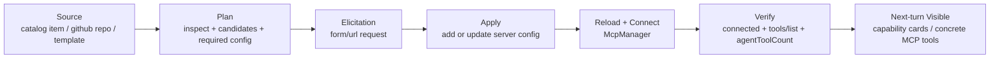
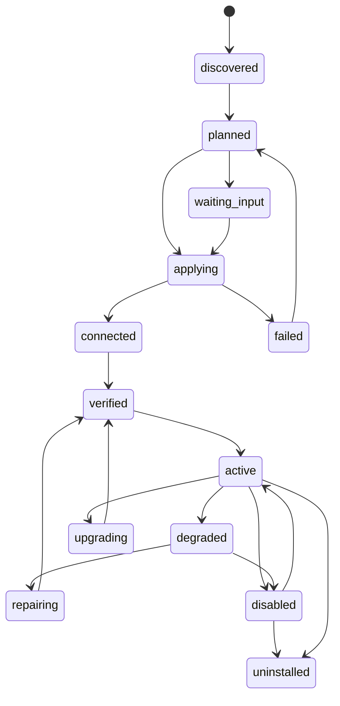

# MCP 助手托管安装与配置生命周期 v0.1

> 状态：implemented (with noted deviations)
> 日期：2026-03-22
> HEAD：`2e3c6a4b626598a55f90bfbd211dcd89c1d0cd5d`
> 目标：让 Crab 在“助手模式”下支持通过对话完成 MCP 的搜索/导入/规划/配置/安装/启用/验证，并继续复用现有 Desktop MCP 运行时与 Marketplace，而不是再开一套旁路逻辑。

---

## 实施状态（2026-03-22）

| Spec 条目 | 文件/符号 | 状态 | 验证 | 备注 |
|----------|----------|------|------|------|
| Desktop 生命周期主线：store + service + shared IPC | `/Users/noah/writing-ide/apps/desktop/electron/mcp-lifecycle-store.mjs` `/Users/noah/writing-ide/apps/desktop/electron/mcp-lifecycle-service.mjs` `/Users/noah/writing-ide/apps/desktop/electron/main.cjs` `/Users/noah/writing-ide/apps/desktop/electron/preload.cjs` | 已完成 | `node --check apps/desktop/electron/mcp-lifecycle-store.mjs` `node --check apps/desktop/electron/mcp-lifecycle-service.mjs` `node --check apps/desktop/electron/main.cjs` `node --check apps/desktop/electron/preload.cjs` | 新增 pending request / managed server / health sweep，Settings/Marketplace/Agent 共用同一主进程服务 |
| Marketplace 安装/卸载复用 shared lifecycle | `/Users/noah/writing-ide/apps/desktop/electron/marketplace-manager.mjs` | 已完成 | `node --check apps/desktop/electron/marketplace-manager.mjs` | `mcp_server` 安装/卸载优先走 lifecycle service，旧逻辑保留 fallback |
| Agent 工具合同与助手模式门禁 | `/Users/noah/writing-ide/packages/tools/src/index.ts` `/Users/noah/writing-ide/apps/desktop/src/agent/toolRegistry.ts` `/Users/noah/writing-ide/apps/gateway/src/agent/coreTools.ts` | 已完成 | `npm run -w @ohmycrab/gateway build` `npm run -w @ohmycrab/desktop build` | `mcpServer.*` 工具已接入 Desktop lifecycle，命名避开 `mcp.*` concrete tool namespace |
| Settings GitHub 导入改走 shared planner | `/Users/noah/writing-ide/apps/desktop/src/ui/components/SettingsModal.tsx` | 已完成 | `npm run -w @ohmycrab/desktop build` | 优先调用 `window.desktop.mcp.planInstall(...)`；旧 renderer heuristics 仅作 fallback，不再是事实源 |
| Thread waiting state 接管 `needsInput` | `/Users/noah/writing-ide/apps/gateway/src/agent/runFactory.ts` `/Users/noah/writing-ide/apps/desktop/src/state/runStore.ts` `/Users/noah/writing-ide/packages/shared/src/runtime/thread-turn-item.ts` | 已完成 | `npm run -w @ohmycrab/gateway build` `npm run -w @ohmycrab/desktop build` | `mcpServer.applyInstall/test/applyUpgrade` 返回 `needs_input` 时会写入 `waiting.kind=requestId`，且不会被 `run.end(completed)` 立即清掉 |
| Waiting UI 消费层 | `/Users/noah/writing-ide/apps/desktop/src/ui/components/ChatArea.tsx` | 无需改动 | `npm run -w @ohmycrab/desktop build` | 现有 `hasWaitingWorkflowThread()` 已基于 `waitingFor=user/approval` 生效，新 kind 不需要额外分支 |
| 偏差：proposal-first | `/Users/noah/writing-ide/apps/desktop/src/agent/toolRegistry.ts` | 暂未按 spec 完成 | N/A | 当前 `mcpServer.*` 先走 `auto_apply`，因为现有 apply runtime 还不能把结构化 `tool.result` 回注到 Keep/apply 闭环；后续需先补 runtime 协议再切回 proposal-first |

- 行为烟测：使用 fake `McpManager` 跑通 `applyInstall -> needs_input -> resolvePendingRequest -> connected` 最小续跑事务。

---

## 0. 结论先行

这次不该继续往设置页里堆 GitHub 导入 heuristics，也不该让 Agent 通过 `shell.exec` 自己瞎装。

推荐方案是把 MCP 拆成两层：

1. 使用层：继续沿用现有 `mcp.<serverId>.<toolName>`、`agentTools`、capability cards、thread-first 渐进暴露。
2. 生命周期层：新增一套由 Desktop 主进程托管的 MCP 生命周期合同，统一负责：
   - `catalog search`
   - `repo inspect`
   - `install plan`
   - `config elicitation`
   - `apply`
   - `reload/connect`
   - `verify`
   - `activate/resume`
   - `observe/repair`
   - `upgrade/retire`

一句话版本：

> 让 Crab “自己装 MCP”这件事成立的关键，不是再加一个导入按钮，而是把 MCP 安装/配置/验证做成助手模式下一等能力，并复用同一套主进程服务给 Settings、Marketplace 和 Agent 三条入口。

---

## 1. 预检索引

### 1.1 已有文档

- `/Users/noah/writing-ide/docs/specs/mcp-integration-standard-v0.1.md`
- `/Users/noah/writing-ide/docs/specs/mcp-validation-strategy-v1.md`
- `/Users/noah/writing-ide/docs/specs/marketplace-v0.1.md`
- `/Users/noah/writing-ide/docs/specs/tool-retrieval-v0.2-codex-parity.md`
- `/Users/noah/writing-ide/docs/specs/thread-first-progressive-capability-exposure-v0.1.md`
- `/Users/noah/writing-ide/docs/specs/tools-fs-and-runtime-refactor-v0.1.md`
- `/Users/noah/writing-ide/docs/research/mcp-fat-server-profile-and-codex-parity-v1.md`
- `/Users/noah/writing-ide/docs/research/mcp-hierarchical-tool-selection-v1.md`
- `/Users/noah/writing-ide/docs/research/mcp-session-reliability-and-thread-accounting-repair-v1.md`

### 1.2 近期相关 commit

- `fb35a13` `fix: prevent MCP tools from disappearing across runs and tools.search`
- `d406c3a` `fix(mcp): harden stdio startup & runtime discovery`
- `8e56110` `fix(mcp): migrate Lark legacy args and surface stderr diagnostics`
- `703176a` `fix(desktop): stabilize active runtime strips`
- `9e9800f` `feat: close claude skill github install and bridge parity`

### 1.3 已有上下文结论

- MCP 运行时（连接、重连、调用、agentTools 收敛）已经存在，不应推翻重写。
- Marketplace 安装 `mcp_server` 后已能热接入到 `McpManager`，说明“安装后生效”底座已具备。
- GitHub 导入现在只是 UI 里的 heuristics 草稿生成器，还不是安装器。
- 线程级 capability exposure 已经实现，后续要接的是“新装上的 MCP 怎么进入这一套体系”，而不是再造一个工具暴露系统。

---

## 2. 需求卡片

- 场景：用户在助手模式下，直接告诉 Crab“装某个 MCP”，或给一个官方仓库 URL，希望 Crab 自己识别、自己安装、自己知道缺什么配置、并在安装后可用。
- 目标：把 MCP 从“设置页手动配置功能”升级为“助手模式可执行的生命周期能力”。
- 对标：本地 `third_party/openai-codex` 中的 plugin install + `mcpServer/elicitation/request`。
- 约束：
  - 不引入第二套 MCP 安装逻辑。
  - 不破坏现有 Settings / Marketplace / `mcpManager` / capability exposure。
  - 高风险动作只在助手模式开放。
  - 不泄露用户配置中的密钥。
  - 不把 `mcp.<serverId>.<toolName>` 现有命名空间打乱。
- 不做什么：
  - v0.1 不支持“任意仓库 clone 后执行任意安装脚本”。
  - v0.1 不承诺“同一个 tool call 结束前立即扩容当前回合的全部 MCP 工具池”。
  - v0.1 不删除现有 Lark 兼容特判，只把它们收敛进 contract 化方向并保留 fallback。

---

## 3. 现状地图

### 3.1 相关文件

| 文件 | 职责 | 与本需求关系 |
|------|------|------------|
| `/Users/noah/writing-ide/apps/desktop/electron/mcp-manager.mjs` | MCP server 配置持久化、连接、工具列表、调用、runtime health | 生命周期执行核心，已具备 add/update/connect/disconnect/call/repair |
| `/Users/noah/writing-ide/apps/desktop/electron/marketplace-manager.mjs` | 安装 skill / mcp_server 到本地 | 已有 `mcp_server` 安装事务，但只接受 manifest+payload，不会做 repo 规划 |
| `/Users/noah/writing-ide/apps/desktop/electron/main.cjs` | Desktop IPC 主入口 | 需要新增 Agent/Settings 共用的 MCP 生命周期 IPC |
| `/Users/noah/writing-ide/apps/desktop/electron/preload.cjs` | Renderer 桥接 | 需要暴露新 MCP 生命周期 API |
| `/Users/noah/writing-ide/apps/desktop/src/agent/toolRegistry.ts` | Desktop 内置工具实现 | 需要新增 `mcpServer.*` 高阶工具 |
| `/Users/noah/writing-ide/packages/tools/src/index.ts` | 工具合同单一来源 | 需要新增 `mcpServer.*` 元数据与说明 |
| `/Users/noah/writing-ide/apps/gateway/src/agent/coreTools.ts` | opMode 下的核心/高风险工具门禁 | 需要把 mutating 的 MCP 生命周期工具纳入助手模式门禁 |
| `/Users/noah/writing-ide/apps/desktop/src/ui/components/SettingsModal.tsx` | 当前 Settings 的 MCP UI 与 GitHub 导入 heuristics | 需要改成调用主进程 shared planner，而不是继续在 renderer 里猜命令 |
| `/Users/noah/writing-ide/apps/desktop/src/agent/wsTransport.ts` | 每轮 sidecar MCP 快照注入 | 安装完成后的“下一轮可见”边界由这里承接 |
| `/Users/noah/writing-ide/apps/gateway/src/marketplaceCatalog.ts` | 官方/审核 MCP catalog | 可复用为“按名字装 MCP”的 catalog 来源 |

### 3.2 已有设施

- `McpManager.addServer/updateServer/connect/disconnect/callTool/getRuntimeHealth/repairRuntime`
- `MarketplaceManager._installMcpServer()` 已可直接落配置并调用 `McpManager`
- `McpManager.getServers()` 已返回 `tools + agentTools + familyHint + toolProfile`
- `thread-first progressive capability exposure` 已能把 MCP 以 capability cards + concrete tools 方式注入线程
- 助手模式（`opMode=assistant`）与高风险工具门禁已存在
- `skill.install` 已经形成“高风险 Desktop 生命周期工具”的可复用模式

### 3.3 约束点

1. **不能新增 builtin 工具名 `mcp.*`**
   - 当前 `wsTransport.ts` 会把所有 `mcp.` 前缀工具都当成 concrete MCP tool 路由。
   - 因此 builtin 生命周期工具若命名为 `mcp.install`、`mcp.configure` 会与真实 MCP 工具命名空间冲突。

2. **不能再复制一份 repo import 逻辑**
   - 当前 GitHub 导入在 `SettingsModal.tsx`，如果 Agent 再复制一套，会变成 UI 和 Agent 两套 heuristics。

3. **不能假设当前 run 内的 tool 声明可以随意替换**
   - 当前体系里“热生效”的稳定边界仍然是下一轮 / 下一次 sidecar snapshot。

4. **不能把密钥字段原样暴露给模型**
   - 现有 `getServers()` 会把 `config.env` 原样带回 renderer，Agent 新工具必须单独做 redaction。

5. **不能把 runtime bootstrap 和 MCP install 混成一件事**
   - 现有 `repairRuntime()` 主要覆盖 `uv/uvx`，Node/npm/npx 仍不是完整自动修复路径。

### 3.4 最自然的扩展点

- 主进程新增一个专门的 `McpLifecycleService`
- Settings、Marketplace、Agent 全部调用这一个 service
- `McpManager` 继续只负责“已知配置 -> 连接与运行”
- `thread-first capability exposure` 继续只负责“已连接 MCP -> 如何暴露给模型”

---

## 4. 外部调研摘要

### 4.1 Codex 一手证据

#### 证据 A：plugin install 是一等协议，不是 UI 私有逻辑

文件：
- `/Users/noah/writing-ide/third_party/openai-codex/codex-rs/app-server/src/codex_message_processor.rs:5597-5704`

结论：
- 安装后会 reload config。
- 安装后会继续检查 app metadata / accessible connectors。
- 返回 `apps_needing_auth`，而不是假装安装完成。

#### 证据 B：MCP 缺配置时使用结构化 elicitation，而不是让模型瞎追问

文件：
- `/Users/noah/writing-ide/third_party/openai-codex/codex-rs/app-server/README.md:927-939`
- `/Users/noah/writing-ide/third_party/openai-codex/codex-rs/app-server/tests/suite/v2/mcp_server_elicitation.rs:74-274`

结论：
- MCP server 可中断当前 turn，发 `mcpServer/elicitation/request`。
- request 形态分为 `form` 与 `url`。
- client 回填后，再继续完成 turn。

### 4.2 可借鉴

- `install -> reload -> verify` 是一条完整事务，不是“写了配置就算成功”
- 配置采集应该有结构化 schema，而不是靠 prompt 模糊追问
- 安装后应返回“还缺哪些 auth / config”，而不是只返回 ok

### 4.3 要规避

- 不把 Codex 的 plugin marketplace path 照抄成 Crab 的 repo import
- 不把 Codex 的 connectors/apps 平台层整体照搬进 Crab
- 不在 Crab 里新增另一套与 `MarketplaceManager/McpManager` 平行的安装器

### 4.4 结论

- 推荐模式：Desktop 主进程统一托管 MCP lifecycle，Agent 通过高阶工具调用，UI 通过同一 service 复用。
- 放弃模式：Renderer heuristics + 手写 prompt 指导 + shell 命令安装三种方式并存。

---

## 5. 推荐方案

### 5.1 核心原则

1. **单核心执行**
   - 所有 MCP 安装/配置/验证都收敛到一个 Desktop 主进程 service。

2. **plan/apply 分离**
   - 先规划，再安装。
   - 先返回结构化缺口，再问用户。

3. **prefix 避让**
   - 生命周期工具统一使用 `mcpServer.*`，明确避开 `mcp.` concrete tool 命名空间。

4. **UI / Agent 同源**
   - Settings 的 GitHub 导入与 Agent 的 repo 安装都走同一 planner。

5. **热生效边界明确**
   - v0.1 保证“安装成功后下一轮 / 同线程下一次模型回合可见”。
   - 不把“当前回合 tool 声明立即整体刷新”作为 P0 承诺。

6. **新增最少、复用优先**
   - 只有 `searchCatalog / planInstall / applyInstall / resolvePendingRequest / planUpgrade / applyUpgrade / uninstallServer` 这类生命周期动作新增专用 IPC。
   - `list / updateConfig / enable / disable / repairRuntime` 优先复用现有 `mcp.getServers / updateServer / connect / disconnect / repairRuntime` 低层桥，避免在 Desktop 再裂变一层重复接口。

### 5.2 生命周期分层



### 5.2.1 生命周期状态机（闭环版）



说明：

- `planned -> waiting_input`：缺密钥、缺 OAuth、缺 endpoint 时进入等待态。
- `waiting_input -> applying`：用户通过结构化表单或授权 URL 回填后继续。
- `verified -> active`：不仅连接成功，还已经进入当前线程的 capability/runtime 视图。
- `active -> degraded`：auth 过期、runtime 缺失、server error、tools/list 失败等。
- `degraded -> repairing`：走 `repairRuntime/updateConfig/applyUpgrade` 等恢复动作。
- `active|disabled -> uninstalled`：表示完整退场与清理，而不只是 UI 隐藏。

### 5.3 数据合同

#### `McpInstallSource`

```ts
type McpInstallSource =
  | { kind: "catalog_item"; itemId: string; version?: string }
  | { kind: "github_repo"; url: string }
  | { kind: "manual_template"; templateId: string };
```

#### `McpInstallCandidate`

```ts
type McpInstallCandidate = {
  candidateId: string;
  title: string;
  sourceKind: "catalog_item" | "github_repo" | "manual_template";
  installKind: "marketplace_payload" | "stdio_package" | "http_endpoint";
  confidence: "high" | "medium" | "low";
  serverDraft: {
    idHint?: string;
    name: string;
    transport: "stdio" | "streamable-http" | "sse";
    command?: string;
    args?: string[];
    endpoint?: string;
    familyHint?: string;
    toolProfile?: string;
    configFields?: McpConfigField[];
  };
  runtimeNeeds: {
    commands: string[];
    autoRepairableCommands: string[];
  };
  warnings: string[];
};
```

#### `McpElicitationRequest`

```ts
type McpElicitationRequest =
  | {
      mode: "form";
      message: string;
      fields: Array<{
        key: string;
        label: string;
        secret?: boolean;
        required?: boolean;
        helpUrl?: string;
        helpText?: string;
        source: "env" | "header" | "endpoint";
      }>;
    }
  | {
      mode: "url";
      message: string;
      url: string;
      reason: "oauth" | "docs";
    };
```

#### `McpApplyResult`

```ts
type McpApplyResult = {
  ok: boolean;
  requestId?: string;
  serverId?: string;
  status?: "connected" | "error" | "needs_input";
  connected?: boolean;
  toolCount?: number;
  agentToolCount?: number;
  warnings?: string[];
  nextTurnVisible?: boolean;
  needsInput?: McpElicitationRequest | null;
  maskedConfigKeys?: string[];
  error?: string;
};
```

#### `McpPendingRequest`

```ts
type McpPendingRequest = {
  requestId: string;
  threadId?: string | null;
  serverId?: string | null;
  candidateId?: string | null;
  intent: "install" | "update" | "upgrade" | "repair";
  mode: "form" | "url";
  request: McpElicitationRequest;
  status: "pending" | "accepted" | "declined" | "cancelled" | "expired";
  createdAt: string;
  updatedAt: string;
  expiresAt?: string;
};
```

#### `ManagedMcpServerRecord`

```ts
type ManagedMcpServerRecord = {
  serverId: string;
  managedBy: "manual" | "marketplace" | "assistant";
  source: McpInstallSource | null;
  installState:
    | "planned"
    | "needs_input"
    | "installed"
    | "verified"
    | "active"
    | "degraded"
    | "disabled"
    | "uninstalled";
  authState: "ready" | "needs_auth" | "expired" | "error" | "unknown";
  pendingRequestId?: string | null;
  lastVerifiedAt?: string;
  lastHealthyAt?: string;
  lastError?: string;
  updateAvailable?: {
    targetVersion: string;
    source: "catalog" | "provider";
  } | null;
};
```

#### `McpUpgradePlan`

```ts
type McpUpgradePlan = {
  ok: boolean;
  serverId: string;
  currentVersion?: string;
  targetVersion?: string;
  sourceKind: "catalog_item" | "github_repo" | "manual_template" | "unknown";
  breakingRisk: "low" | "medium" | "high";
  warnings: string[];
  requiresInput?: boolean;
};
```

### 5.4 工具合同

推荐新增以下 builtin 工具：

- `mcpServer.searchCatalog`
- `mcpServer.planInstall`
- `mcpServer.applyInstall`
- `mcpServer.list`
- `mcpServer.updateConfig`
- `mcpServer.enable`
- `mcpServer.disable`
- `mcpServer.test`
- `mcpServer.repairRuntime`
- `mcpServer.planUpgrade`
- `mcpServer.applyUpgrade`
- `mcpServer.uninstall`

其中：

- `searchCatalog` / `list` / `test` 为读多写少工具，可保持 `riskLevel=low/medium`
- `planInstall` / `applyInstall` / `updateConfig` / `enable` / `disable` / `repairRuntime` / `planUpgrade` / `applyUpgrade` / `uninstall` 统一视为助手模式工具

补充说明：

- `resolvePendingRequest` 不作为模型可见工具暴露，优先作为 Desktop UI / IPC 的结构化回填接口存在，避免让模型直接接触 secret form 值。
- `mcpServer.uninstall` 与 Marketplace 卸载要最终收敛到同一条退场逻辑，保证 capabilityState、installed registry、lifecycle store 同步清理。

### 5.5 为什么契合当前框架

- 复用了 `McpManager`
- 复用了 `MarketplaceManager`
- 复用了 `assistant mode`
- 复用了 `thread-first capability exposure`
- 复用了 `skill.install` 这条“Desktop 高风险生命周期工具”既有实现范式

---

## 6. 可行备选方案（不推荐）

### 6.1 备选 A：继续增强 `SettingsModal.tsx` 的 GitHub 导入，再让 Agent 教用户手动点

优点：
- 改动面最小

问题：
- 仍然是 UI 路径和 Agent 路径两套逻辑
- 无法做到“告诉 Crab 自己装”
- 配置采集、验证、审计都散落在 UI 和 prompt 里

结论：
- 放弃

### 6.2 备选 B：直接给 Agent 一个 `shell.exec` 模板，让它自己安装任何 repo

优点：
- 表面上最灵活

问题：
- 高风险且不可审计
- 会把 repo 安装、runtime bootstrap、MCP config 三件事糊在一起
- 与现有 `MarketplaceManager/McpManager` 平行，极易引入新问题

结论：
- 放弃

### 6.3 备选 C：新增 builtin `mcp.install / mcp.configure / mcp.test`

优点：
- 命名直觉

问题：
- 与当前 `mcp.<serverId>.<toolName>` concrete MCP namespace 冲突

结论：
- 明确禁止

---

## 7. 分阶段实施

### Phase A（P0，建议先做）

- 新增主进程 `McpLifecycleService`
- 新增 `mcpServer.searchCatalog`
- 抽出 repo inspect / install plan / apply / verify 合同
- Agent 新增 `mcpServer.*` 工具
- Settings 的 GitHub 导入改用同一 planner
- Marketplace 的 MCP 安装改走同一 apply helper
- 保证安装成功后下一轮可见

### Phase B（P1）

- 引入 provider contract
- Lark / GitHub 等模板从 hardcode 迁移为 declarative contract
- 增强 `test` 与 auth gap 检测
- 增强 catalog ranking / source filtering / 权限提示

### Phase C（P2）

- 结构化 config elicitation UI（form/url）
- 同线程安装后自动刷新 capability state
- 逐步去除 `mcp-manager.mjs` 里的 serverId 特判

### Phase D（P3）

- 将 `needsInput` 正式接入 thread waiting state，而不是只返回一段错误文本
- 引入 `requestId + pending request` 存储，支持表单/OAuth 回填后继续原线程
- 安装/升级/修复成功后自动把 `capabilityState` 从 `needs_auth/error` 提升为 `ready`
- 把“安装成功后继续完成原任务”做成真实续跑链，而不是让用户手动重新描述一遍需求

### Phase E（P4）

- 增加 managed lifecycle store，持久化 `pendingRequests / managedServers / lastVerifiedAt / authState / updateAvailable`
- 增加后台 health sweep 与 drift detection，支持：
  - auth 过期
  - tools/list 失败
  - runtime 丢失
  - marketplace/provider 发现新版本
- 支持 `planUpgrade/applyUpgrade/uninstall`，形成完整维护/退场闭环
- 能把 degraded server 反映到 capability cards / MCP 设置页 / Agent 提示里，而不是只在错误时临时弹一条日志

---

## 8. 改动点清单（带 HEAD 行号与 unified diff）

### 改动点 1：新增主进程 `McpLifecycleService`

- 优先级：P0
- 文件：`/Users/noah/writing-ide/apps/desktop/electron/mcp-lifecycle-service.mjs`
- 符号/模块：`McpLifecycleService`
- 当前 HEAD：`2e3c6a4b626598a55f90bfbd211dcd89c1d0cd5d`
- 当前行号：N/A（新文件）
- 改动原理：
  - 把 repo inspect、catalog search、plan、apply、verify 收敛到主进程；
  - 避免 Settings/Marketplace/Agent 三条路径各写一套。
- unified diff：

```diff
--- /dev/null
+++ b/apps/desktop/electron/mcp-lifecycle-service.mjs
@@
+export class McpLifecycleService {
+  constructor({ mcpManager, marketplaceCatalog, marketplaceManager, userDataPath }) { ... }
+
+  async searchCatalog({ query }) { ... }
+  async planInstall({ source }) { ... }
+  async applyInstall({ source, candidateId, configValues, confirm }) { ... }
+  async resolvePendingRequest({ requestId, action, values }) { ... }
+  async listServers({ redactSecrets = true }) { ... }
+  async updateConfig({ serverId, configValues }) { ... }
+  async enableServer({ serverId }) { ... }
+  async disableServer({ serverId }) { ... }
+  async repairRuntime({ serverId }) { ... }
+  async testServer({ serverId }) { ... }
+  async planUpgrade({ serverId }) { ... }
+  async applyUpgrade({ serverId, confirm }) { ... }
+  async uninstallServer({ serverId, confirm }) { ... }
+  async runHealthSweep() { ... }
+}
```

- 边界情况：
  - `planInstall` 只做 metadata inspect，不执行 repo 代码
  - `applyInstall` 不接受任意 shell 命令文本，必须从 `source + candidateId` 重新计算安装候选
  - `resolvePendingRequest` 只接受由 Desktop 主进程自己签发的 `requestId`
  - `listServers/updateConfig/enableServer/disableServer/repairRuntime` 是生命周期 service 对现有 `McpManager` 能力的高层收口，不应再复制一套底层配置写盘逻辑
  - 输出必须 redact secret，不把 env value 返回给模型
- 验证方式：
  - 给 repo URL，可返回候选 plan + config gap
  - 给 catalog item，可返回安装计划
  - `applyInstall` 成功后能得到 `serverId + agentToolCount`
  - `applyInstall -> needsInput -> resolvePendingRequest` 能继续原 install session

### 改动点 2：`main.cjs` 增加 MCP 生命周期 IPC，且不新开平行安装链

- 优先级：P0
- 文件：`/Users/noah/writing-ide/apps/desktop/electron/main.cjs`
- 符号/函数：MCP / Marketplace IPC 区块
- 当前 HEAD：`2e3c6a4b626598a55f90bfbd211dcd89c1d0cd5d`
- 当前行号：`6551-6663`
- 改动原理：
  - 在主进程创建单例 `mcpLifecycleService`
  - 仅为生命周期新增必须的 IPC：`searchCatalog / planInstall / applyInstall / resolvePendingRequest / testServer / planUpgrade / applyUpgrade / uninstallServer`
  - 现有 `marketplace.install` 在 `mcp_server` 分支也改调 shared helper
- unified diff：

```diff
--- a/apps/desktop/electron/main.cjs
+++ b/apps/desktop/electron/main.cjs
@@
-let marketplaceManager = null;
+let marketplaceManager = null;
+let mcpLifecycleService = null;
@@
+ipcMain.handle("mcp.searchCatalog", async (_event, args) => {
+  if (!mcpLifecycleService) return { ok: false, error: "MCP_LIFECYCLE_NOT_READY" };
+  return mcpLifecycleService.searchCatalog(args ?? {});
+});
+ipcMain.handle("mcp.planInstall", async (_event, args) => {
+  if (!mcpLifecycleService) return { ok: false, error: "MCP_LIFECYCLE_NOT_READY" };
+  return mcpLifecycleService.planInstall(args ?? {});
+});
+ipcMain.handle("mcp.applyInstall", async (_event, args) => {
+  if (!mcpLifecycleService) return { ok: false, error: "MCP_LIFECYCLE_NOT_READY" };
+  return mcpLifecycleService.applyInstall(args ?? {});
+});
+ipcMain.handle("mcp.resolvePendingRequest", async (_event, args) => {
+  if (!mcpLifecycleService) return { ok: false, error: "MCP_LIFECYCLE_NOT_READY" };
+  return mcpLifecycleService.resolvePendingRequest(args ?? {});
+});
+ipcMain.handle("mcp.testServer", async (_event, args) => {
+  if (!mcpLifecycleService) return { ok: false, error: "MCP_LIFECYCLE_NOT_READY" };
+  return mcpLifecycleService.testServer(args ?? {});
+});
+ipcMain.handle("mcp.planUpgrade", async (_event, args) => {
+  if (!mcpLifecycleService) return { ok: false, error: "MCP_LIFECYCLE_NOT_READY" };
+  return mcpLifecycleService.planUpgrade(args ?? {});
+});
+ipcMain.handle("mcp.applyUpgrade", async (_event, args) => {
+  if (!mcpLifecycleService) return { ok: false, error: "MCP_LIFECYCLE_NOT_READY" };
+  return mcpLifecycleService.applyUpgrade(args ?? {});
+});
+ipcMain.handle("mcp.uninstallServer", async (_event, args) => {
+  if (!mcpLifecycleService) return { ok: false, error: "MCP_LIFECYCLE_NOT_READY" };
+  return mcpLifecycleService.uninstallServer(args ?? {});
+});
```

- 边界情况：
  - `mcp.getServers / updateServer / connect / disconnect / repairRuntime` 继续存在，供 UI store 与 `mcpServer.list/updateConfig/enable/disable/repairRuntime` 复用
  - lifecycle IPC 返回给 Agent 的结果必须是 redacted 版
  - `resolvePendingRequest` 主要服务 UI / OAuth 回调，不默认向模型暴露
- 验证方式：
  - preload 能调用新 IPC
  - Settings 和 Agent 共用同一实现
  - 现有 MCP 设置页手工编辑能力不被新 IPC 覆盖或打断

### 改动点 3：`preload.cjs` 扩充 `desktop.mcp` bridge

- 优先级：P0
- 文件：`/Users/noah/writing-ide/apps/desktop/electron/preload.cjs`
- 符号/函数：`mcp` bridge
- 当前 HEAD：`2e3c6a4b626598a55f90bfbd211dcd89c1d0cd5d`
- 当前行号：`243-279`
- 改动原理：
  - 继续沿用 `window.desktop.mcp.*`
  - 不再新增 `window.desktop.mcpLifecycle.*` 第二套命名
- unified diff：

```diff
--- a/apps/desktop/electron/preload.cjs
+++ b/apps/desktop/electron/preload.cjs
@@
   mcp: {
     getServers() { ... },
     addServer(config) { ... },
@@
+    searchCatalog(args) {
+      return ipcRenderer.invoke("mcp.searchCatalog", args);
+    },
+    planInstall(args) {
+      return ipcRenderer.invoke("mcp.planInstall", args);
+    },
+    applyInstall(args) {
+      return ipcRenderer.invoke("mcp.applyInstall", args);
+    },
+    resolvePendingRequest(args) {
+      return ipcRenderer.invoke("mcp.resolvePendingRequest", args);
+    },
+    testServer(args) {
+      return ipcRenderer.invoke("mcp.testServer", args);
+    },
+    planUpgrade(args) {
+      return ipcRenderer.invoke("mcp.planUpgrade", args);
+    },
+    applyUpgrade(args) {
+      return ipcRenderer.invoke("mcp.applyUpgrade", args);
+    },
+    uninstallServer(args) {
+      return ipcRenderer.invoke("mcp.uninstallServer", args);
+    },
   },
```

- 边界情况：
  - 不把低层 `ipcRenderer.invoke(...)` 暴露给业务层直接乱用
  - bridge 接口命名要与 Settings / toolRegistry / future UI form 保持一致
  - `getServers/updateServer/connect/disconnect/repairRuntime` 继续保留并被高阶工具复用，不为它们再平移一层“新名字但同语义”的 IPC
- 验证方式：
  - renderer 可通过 `window.desktop.mcp.planInstall(...)` 正常拿到结构化结果

### 改动点 4：工具合同新增 `mcpServer.*`，并明确避开 `mcp.` 前缀

- 优先级：P0
- 文件：`/Users/noah/writing-ide/packages/tools/src/index.ts`
- 符号/函数：`TOOL_LIST`
- 当前 HEAD：`2e3c6a4b626598a55f90bfbd211dcd89c1d0cd5d`
- 当前行号：建议插入 `1244` 附近（`skill.install` 相邻）
- 改动原理：
  - 这些是 Desktop 生命周期工具，语义更接近 `skill.install`，不属于 concrete MCP tool
- unified diff：

```diff
--- a/packages/tools/src/index.ts
+++ b/packages/tools/src/index.ts
@@
   {
     name: "skill.install",
     ...
   },
+  {
+    name: "mcpServer.searchCatalog",
+    description: "搜索官方/审核 MCP catalog，返回可安装候选。",
+    args: [{ name: "query", required: true, desc: "搜索词", type: "string" }],
+    modes: ["agent"],
+  },
+  {
+    name: "mcpServer.planInstall",
+    description: "为某个 MCP 来源生成安装计划，不直接执行安装。支持 catalog item 或 GitHub 仓库 URL。",
+    args: [{ name: "source", required: true, desc: "JSON source object", type: "object" }],
+    modes: ["agent"],
+  },
+  {
+    name: "mcpServer.applyInstall",
+    description: "根据 source + candidateId + configValues 执行 MCP 安装、连接与验证。只应在助手模式下使用。",
+    args: [
+      { name: "source", required: true, desc: "source object", type: "object" },
+      { name: "candidateId", required: true, desc: "candidate id", type: "string" },
+      { name: "configValues", required: false, desc: "配置值", type: "object" },
+      { name: "confirm", required: true, desc: "显式确认执行安装", type: "boolean" }
+    ],
+    modes: ["agent"],
+  },
+  {
+    name: "mcpServer.list",
+    description: "列出当前已配置的 MCP server，返回脱敏后的运行与托管状态摘要。",
+    args: [],
+    modes: ["agent"],
+  },
+  {
+    name: "mcpServer.updateConfig",
+    description: "更新某个 MCP server 的配置，并返回脱敏后的新状态。",
+    args: [
+      { name: "serverId", required: true, desc: "server id", type: "string" },
+      { name: "configValues", required: true, desc: "配置更新", type: "object" }
+    ],
+    modes: ["agent"],
+  },
+  {
+    name: "mcpServer.enable",
+    description: "启用并连接某个 MCP server。",
+    args: [{ name: "serverId", required: true, desc: "server id", type: "string" }],
+    modes: ["agent"],
+  },
+  {
+    name: "mcpServer.disable",
+    description: "断开并禁用某个 MCP server。",
+    args: [{ name: "serverId", required: true, desc: "server id", type: "string" }],
+    modes: ["agent"],
+  },
+  {
+    name: "mcpServer.repairRuntime",
+    description: "修复 MCP server 所需运行时环境，然后重新验证。",
+    args: [{ name: "serverId", required: true, desc: "server id", type: "string" }],
+    modes: ["agent"],
+  },
+  {
+    name: "mcpServer.test",
+    description: "测试某个已安装 MCP server 的连接状态与工具暴露情况。",
+    args: [{ name: "serverId", required: true, desc: "server id", type: "string" }],
+    modes: ["agent"],
+  },
+  {
+    name: "mcpServer.planUpgrade",
+    description: "为某个已托管 MCP server 生成升级计划，不直接执行升级。",
+    args: [{ name: "serverId", required: true, desc: "server id", type: "string" }],
+    modes: ["agent"],
+  },
+  {
+    name: "mcpServer.applyUpgrade",
+    description: "执行某个已托管 MCP server 的升级，并在完成后重新验证。",
+    args: [
+      { name: "serverId", required: true, desc: "server id", type: "string" },
+      { name: "confirm", required: true, desc: "显式确认执行升级", type: "boolean" }
+    ],
+    modes: ["agent"],
+  },
+  {
+    name: "mcpServer.uninstall",
+    description: "卸载某个已托管 MCP server，并清理 capability/lifecycle 状态。",
+    args: [
+      { name: "serverId", required: true, desc: "server id", type: "string" },
+      { name: "confirm", required: true, desc: "显式确认执行卸载", type: "boolean" }
+    ],
+    modes: ["agent"],
+  },
```

- 边界情况：
  - 不能出现 `mcp.planInstall` 这种名字
  - `planInstall` 输出必须是结构化计划，不返回可执行 shell 文本
  - `mcpServer.list/updateConfig/enable/disable/repairRuntime` 虽然复用现有 Desktop bridge，但对模型仍然表现为统一的高阶生命周期语义
  - `planUpgrade/uninstall` 只对 `managedBy=marketplace|assistant` 的 server 默认开放
- 验证方式：
  - 工具目录中能稳定看见 `mcpServer.*`
  - 不会被 `wsTransport` 的 `mcp.` 动态路由误判成 concrete MCP tool

### 改动点 5：助手模式门禁与提示词对齐 `mcpServer.*`

- 优先级：P0
- 文件：`/Users/noah/writing-ide/apps/gateway/src/agent/coreTools.ts`
- 符号/函数：`HIGH_RISK_TOOL_NAMES`
- 当前 HEAD：`2e3c6a4b626598a55f90bfbd211dcd89c1d0cd5d`
- 当前行号：`45-59`
- 改动原理：
  - mutating 生命周期工具必须只在助手模式开放
- unified diff：

```diff
--- a/apps/gateway/src/agent/coreTools.ts
+++ b/apps/gateway/src/agent/coreTools.ts
@@
 export const HIGH_RISK_TOOL_NAMES = [
   "shell.exec",
   "code.exec",
   "process.run",
   "process.list",
   "process.stop",
   "cron.create",
   "cron.list",
   "skill.install",
+  "mcpServer.planInstall",
+  "mcpServer.applyInstall",
+  "mcpServer.updateConfig",
+  "mcpServer.enable",
+  "mcpServer.disable",
+  "mcpServer.repairRuntime",
+  "mcpServer.planUpgrade",
+  "mcpServer.applyUpgrade",
+  "mcpServer.uninstall",
 ] as const;
```

- 边界情况：
  - `mcpServer.list` / `mcpServer.test` 若定义为只读，可不纳入高危集合
  - `mcpServer.searchCatalog` 若仅搜索 catalog，也可保持只读
- 验证方式：
  - 创作模式下工具不可见或调用即被拒绝
  - 助手模式下可用

补充提示词改动：

- 文件：`/Users/noah/writing-ide/apps/gateway/src/agent/runFactory.ts`
- 符号/函数：assistant mode notice / skill creator notice
- 当前 HEAD：`2e3c6a4b626598a55f90bfbd211dcd89c1d0cd5d`
- 当前行号：`1231-1241`、`3264-3269`
- unified diff：

```diff
--- a/apps/gateway/src/agent/runFactory.ts
+++ b/apps/gateway/src/agent/runFactory.ts
@@
- 当前为助手模式：当用户明确要安装最终版 skill 时，可以直接调用 skill.install。
+ 当前为助手模式：安装全局 skill 优先调用 skill.install；安装/配置 MCP 优先调用 mcpServer.planInstall / mcpServer.applyInstall，不要直接用 shell.exec 模拟 MCP 安装。
```

### 改动点 6：Desktop `toolRegistry` 复用 `skill.install` 模式实现 `mcpServer.*`

- 优先级：P0
- 文件：`/Users/noah/writing-ide/apps/desktop/src/agent/toolRegistry.ts`
- 符号/函数：`skill.install` 相邻工具实现区
- 当前 HEAD：`2e3c6a4b626598a55f90bfbd211dcd89c1d0cd5d`
- 当前行号：`3023-3107`
- 改动原理：
  - 复用现有高风险 Desktop 工具模式：参数清洗 -> bridge -> 结构化结果
  - 不让 Gateway 直接操纵 MCP 配置文件
- unified diff：

```diff
--- a/apps/desktop/src/agent/toolRegistry.ts
+++ b/apps/desktop/src/agent/toolRegistry.ts
@@
   {
     name: "skill.install",
     ...
   },
+  {
+    name: "mcpServer.list",
+    riskLevel: "low",
+    applyPolicy: "none",
+    reversible: false,
+    run: async () => {
+      const api = (window as any).desktop?.mcp;
+      if (!api?.getServers) return failToolResult({ code: "MCP_API_NOT_AVAILABLE", message: "MCP API 不可用" });
+      const servers = await api.getServers();
+      return { ok: true, output: sanitizeMcpServerList(servers) };
+    },
+  },
+  {
+    name: "mcpServer.planInstall",
+    riskLevel: "medium",
+    applyPolicy: "proposal",
+    reversible: false,
+    run: async (args) => {
+      const api = (window as any).desktop?.mcp;
+      if (!api?.planInstall) return failToolResult({ code: "MCP_API_NOT_AVAILABLE", message: "MCP 生命周期 API 不可用" });
+      const result = await api.planInstall(args ?? {});
+      return result?.ok ? { ok: true, output: result } : failToolResult({ code: result?.error ?? "PLAN_FAILED", message: result?.detail ?? "failed to plan mcp install" });
+    },
+  },
+  {
+    name: "mcpServer.applyInstall",
+    riskLevel: "high",
+    applyPolicy: "proposal",
+    reversible: false,
+    run: async (args) => {
+      const api = (window as any).desktop?.mcp;
+      if (!api?.applyInstall) return failToolResult({ code: "MCP_API_NOT_AVAILABLE", message: "MCP 生命周期 API 不可用" });
+      const result = await api.applyInstall(args ?? {});
+      return result?.ok ? { ok: true, output: result } : failToolResult({ code: result?.error ?? "APPLY_FAILED", message: result?.detail ?? "failed to apply mcp install" });
+    },
+  },
+  {
+    name: "mcpServer.updateConfig",
+    riskLevel: "high",
+    applyPolicy: "proposal",
+    reversible: true,
+    run: async (args) => {
+      const api = (window as any).desktop?.mcp;
+      if (!api?.updateServer) return failToolResult({ code: "MCP_API_NOT_AVAILABLE", message: "MCP API 不可用" });
+      const result = await api.updateServer(args?.serverId, buildServerConfigPatch(args?.configValues ?? {}));
+      return result?.ok ? { ok: true, output: result } : failToolResult({ code: result?.error ?? "UPDATE_FAILED", message: result?.detail ?? "failed to update mcp config" });
+    },
+  },
+  {
+    name: "mcpServer.enable",
+    riskLevel: "high",
+    applyPolicy: "proposal",
+    reversible: true,
+    run: async ({ serverId }) => {
+      const api = (window as any).desktop?.mcp;
+      if (!api?.connect) return failToolResult({ code: "MCP_API_NOT_AVAILABLE", message: "MCP API 不可用" });
+      const result = await api.connect(serverId);
+      return result?.ok ? { ok: true, output: { serverId, status: "connected" } } : failToolResult({ code: result?.error ?? "ENABLE_FAILED", message: result?.detail ?? "failed to enable mcp server" });
+    },
+  },
+  {
+    name: "mcpServer.disable",
+    riskLevel: "high",
+    applyPolicy: "proposal",
+    reversible: true,
+    run: async ({ serverId }) => {
+      const api = (window as any).desktop?.mcp;
+      if (!api?.disconnect) return failToolResult({ code: "MCP_API_NOT_AVAILABLE", message: "MCP API 不可用" });
+      const result = await api.disconnect(serverId);
+      return result?.ok ? { ok: true, output: { serverId, status: "disabled" } } : failToolResult({ code: result?.error ?? "DISABLE_FAILED", message: result?.detail ?? "failed to disable mcp server" });
+    },
+  },
+  {
+    name: "mcpServer.repairRuntime",
+    riskLevel: "high",
+    applyPolicy: "proposal",
+    reversible: false,
+    run: async ({ serverId }) => {
+      const api = (window as any).desktop?.mcp;
+      if (!api?.repairRuntime) return failToolResult({ code: "MCP_API_NOT_AVAILABLE", message: "MCP API 不可用" });
+      const result = await api.repairRuntime({ serverId });
+      return result?.ok ? { ok: true, output: result } : failToolResult({ code: result?.error ?? "REPAIR_FAILED", message: result?.detail ?? "failed to repair mcp runtime" });
+    },
+  },
+  {
+    name: "mcpServer.test",
+    riskLevel: "low",
+    applyPolicy: "none",
+    reversible: false,
+    run: async ({ serverId }) => {
+      const api = (window as any).desktop?.mcp;
+      if (!api?.testServer) return failToolResult({ code: "MCP_API_NOT_AVAILABLE", message: "MCP 生命周期 API 不可用" });
+      const result = await api.testServer({ serverId });
+      return result?.ok ? { ok: true, output: result } : failToolResult({ code: result?.error ?? "TEST_FAILED", message: result?.detail ?? "failed to test mcp server" });
+    },
+  },
+  {
+    name: "mcpServer.planUpgrade",
+    riskLevel: "medium",
+    applyPolicy: "proposal",
+    reversible: false,
+    run: async ({ serverId }) => {
+      const api = (window as any).desktop?.mcp;
+      if (!api?.planUpgrade) return failToolResult({ code: "MCP_API_NOT_AVAILABLE", message: "MCP 生命周期 API 不可用" });
+      const result = await api.planUpgrade({ serverId });
+      return result?.ok ? { ok: true, output: result } : failToolResult({ code: result?.error ?? "UPGRADE_PLAN_FAILED", message: result?.detail ?? "failed to plan mcp upgrade" });
+    },
+  },
+  {
+    name: "mcpServer.applyUpgrade",
+    riskLevel: "high",
+    applyPolicy: "proposal",
+    reversible: false,
+    run: async (args) => {
+      const api = (window as any).desktop?.mcp;
+      if (!api?.applyUpgrade) return failToolResult({ code: "MCP_API_NOT_AVAILABLE", message: "MCP 生命周期 API 不可用" });
+      const result = await api.applyUpgrade(args ?? {});
+      return result?.ok ? { ok: true, output: result } : failToolResult({ code: result?.error ?? "UPGRADE_FAILED", message: result?.detail ?? "failed to apply mcp upgrade" });
+    },
+  },
+  {
+    name: "mcpServer.uninstall",
+    riskLevel: "high",
+    applyPolicy: "proposal",
+    reversible: false,
+    run: async (args) => {
+      const api = (window as any).desktop?.mcp;
+      if (!api?.uninstallServer) return failToolResult({ code: "MCP_API_NOT_AVAILABLE", message: "MCP 生命周期 API 不可用" });
+      const result = await api.uninstallServer(args ?? {});
+      return result?.ok ? { ok: true, output: result } : failToolResult({ code: result?.error ?? "UNINSTALL_FAILED", message: result?.detail ?? "failed to uninstall mcp server" });
+    },
+  },
```

- 边界情况：
  - tool output 中 secrets 必须 masked
  - `applyInstall` 不应把 `configValues` 原样 log 到 runtime event
  - `list/updateConfig/enable/disable/repairRuntime` 优先复用既有 bridge，不新增平行 IPC
  - `planUpgrade/applyUpgrade/uninstall` 复用同一桥接模式，不再各写一套 Desktop 特例
- 验证方式：
  - `mcpServer.list/planInstall/applyInstall` 在 assistant mode 可正常执行
  - `mcpServer.applyInstall` 失败时能给结构化错误而不是空字符串

### 改动点 7：Settings 的 GitHub 导入改为调用 shared planner，不再保留 renderer heuristics 为事实源

- 优先级：P0
- 文件：`/Users/noah/writing-ide/apps/desktop/src/ui/components/SettingsModal.tsx`
- 符号/函数：`buildMcpDraftFromGithubUrl`
- 当前 HEAD：`2e3c6a4b626598a55f90bfbd211dcd89c1d0cd5d`
- 当前行号：`1102-1227`
- 改动原理：
  - 现有 renderer heuristics 继续存在会和 Agent planner 分叉
  - 应改成 UI 调 `window.desktop.mcp.planInstall({ source: { kind: "github_repo", url } })`
- unified diff：

```diff
--- a/apps/desktop/src/ui/components/SettingsModal.tsx
+++ b/apps/desktop/src/ui/components/SettingsModal.tsx
@@
-async function buildMcpDraftFromGithubUrl(repoUrl: string): Promise<McpDraft> {
-  ...
-}
+async function buildMcpDraftFromGithubUrl(repoUrl: string): Promise<McpDraft> {
+  const api = (window as any).desktop?.mcp;
+  if (!api?.planInstall) throw new Error("MCP 生命周期 API 不可用");
+  const planned = await api.planInstall({ source: { kind: "github_repo", url: repoUrl } });
+  if (!planned?.ok) throw new Error(String(planned?.error ?? "PLAN_FAILED"));
+  return draftFromInstallPlan(planned);
+}
```

- 边界情况：
  - UI 仍保留“用户手动修改 draft”的能力
  - 但 planner 结果必须成为默认事实源
- 验证方式：
  - 同一个 GitHub repo，Settings UI 与 Agent 产出的安装计划一致

### 改动点 8：Marketplace 的 `mcp_server` 安装改走 shared apply helper，并逐步 provider contract 化

- 优先级：P1
- 文件：`/Users/noah/writing-ide/apps/desktop/electron/marketplace-manager.mjs`
- 符号/函数：`_installMcpServer`
- 当前 HEAD：`2e3c6a4b626598a55f90bfbd211dcd89c1d0cd5d`
- 当前行号：`190-236`
- 改动原理：
  - 避免 Marketplace 和 Agent 各写一套安装事务
  - marketplace 记录仍保留，但 apply 动作统一复用 lifecycle service
- unified diff：

```diff
--- a/apps/desktop/electron/marketplace-manager.mjs
+++ b/apps/desktop/electron/marketplace-manager.mjs
@@
-  async _installMcpServer(manifest, payload) {
-    ...
-    if (prevCfg) {
-      const ret = await mgr.updateServer(serverId, cfg);
-      ...
-    } else {
-      const ret = await mgr.addServer(cfg);
-      ...
-    }
-  }
+  async _installMcpServer(manifest, payload) {
+    const lifecycle = this._getMcpLifecycleService();
+    if (!lifecycle) throw new Error("MCP_LIFECYCLE_NOT_READY");
+    const result = await lifecycle.applyInstall({
+      source: { kind: "catalog_item", itemId: String(manifest.id), version: String(manifest.version) },
+      candidateId: "catalog-default",
+      configValues: extractConfigValuesFromMarketplacePayload(payload),
+      confirm: true,
+    });
+    if (!result?.ok) throw new Error(String(result?.error ?? "MCP_INSTALL_FAILED"));
+    return { serverId: String(result.serverId ?? "") };
+  }
```

- 边界情况：
  - marketplace installed log 仍由 `MarketplaceManager` 维护
  - apply 逻辑改为 shared，但安装日志与 installed registry 不丢
- 验证方式：
  - 通过 Marketplace 安装 MCP 后，状态仍能写入 installed registry
  - Agent 通过同一 source 安装时，行为一致

### 改动点 9：将 Lark 等 hardcode 迁往 provider contract，但保留 runtime fallback

- 优先级：P1
- 文件：`/Users/noah/writing-ide/apps/desktop/electron/mcp-manager.mjs`
- 符号/函数：`connect`、`_createTransport`、`_inferServerFamily/_deriveAgentTools`
- 当前 HEAD：`2e3c6a4b626598a55f90bfbd211dcd89c1d0cd5d`
- 当前行号：`1204-1275`、`1498-1605`、`1333-1463`、`2233-2376`
- 改动原理：
  - 把“Lark 需要什么配置/参数/超时/验证方式”搬进 provider contract
  - 但 v0.1 不删除现有 fallback，先双轨兜底
- unified diff：

```diff
--- a/apps/desktop/electron/mcp-manager.mjs
+++ b/apps/desktop/electron/mcp-manager.mjs
@@
-if (serverIdText === "marketplace-lark-openapi-mcp") {
-  connectOptions = { timeout: 180000 };
-}
+const providerHints = resolveProviderRuntimeHints(entry.config);
+if (providerHints?.connectTimeoutMs) {
+  connectOptions = { timeout: providerHints.connectTimeoutMs };
+} else if (serverIdText === "marketplace-lark-openapi-mcp") {
+  connectOptions = { timeout: 180000 };
+}
@@
-if (isLarkMcp) {
+if (providerHints?.argSynthesizer === "lark_openapi" || isLarkMcp) {
   ...
 }
```

- 边界情况：
  - 先 contract-first，fallback-second
  - 不能一上来删除现有 Lark 特判
- 验证方式：
  - 旧的 marketplace Lark 模板仍能连
  - 新 planner 生成的 Lark plan 能获得同样的 timeout / env alias 行为

### 改动点 10：增加 MCP 生命周期回归脚本，防止“装得上但用不了”

- 优先级：P0
- 文件：`/Users/noah/writing-ide/scripts/validate-mcp-stack.sh`
- 符号/函数：Quick / Full validation flow
- 当前 HEAD：`2e3c6a4b626598a55f90bfbd211dcd89c1d0cd5d`
- 当前行号：存在，未逐行展开
- 改动原理：
  - 当前验收主要覆盖 runtime/selection，未覆盖 assistant install lifecycle
- unified diff：

```diff
--- a/scripts/validate-mcp-stack.sh
+++ b/scripts/validate-mcp-stack.sh
@@
 echo "[validate-mcp-stack] 3/5 desktop MCP runtime smoke"
 run npm -w @ohmycrab/desktop run mcp:smoke-runtime
+echo "[validate-mcp-stack] 3.5/5 desktop MCP lifecycle smoke"
+run npm -w @ohmycrab/desktop run mcp:smoke-lifecycle
```

建议新增：

- `/Users/noah/writing-ide/apps/desktop/scripts/mcp-lifecycle-smoke.cjs`

验证内容：

- plan 一个 catalog MCP
- plan 一个 GitHub repo MCP
- apply 一个本地测试模板
- verify 返回 `connected + agentToolCount > 0`

### 改动点 11：将 MCP 生命周期的 `needsInput` 接入 thread waiting state，形成同线程续跑闭环

- 优先级：P3
- 文件：
  - `/Users/noah/writing-ide/apps/gateway/src/agent/runFactory.ts`
  - `/Users/noah/writing-ide/apps/desktop/src/state/runStore.ts`
  - `/Users/noah/writing-ide/apps/desktop/src/ui/components/ChatArea.tsx`
- 符号/函数：
  - `updateThreadWaiting / patchThreadWorkflow`
  - `RuntimeThreadRecord.waiting`
  - `hasWaitingWorkflowThread`
- 当前 HEAD：`2e3c6a4b626598a55f90bfbd211dcd89c1d0cd5d`
- 当前行号：
  - `runFactory.ts:5418-5427`
  - `runFactory.ts:5881-5908`
  - `runStore.ts:199-218`
  - `ChatArea.tsx:318-323`
- 改动原理：
  - 当 `mcpServer.applyInstall/test/applyUpgrade` 返回 `needsInput` 时，不再只把它当普通失败文本返回；
  - 而是写入线程等待状态，挂上 `requestId + question + replyHint`，让 UI 和后续续跑都能理解“当前在等 MCP 配置/授权”。
- unified diff：

```diff
--- a/apps/gateway/src/agent/runFactory.ts
+++ b/apps/gateway/src/agent/runFactory.ts
@@
-          waitingFor: reason === "approval_waiting" ? "approval" : "user",
+          waitingFor: reason === "approval_waiting" ? "approval" : "user",
           waiting: {
             kind:
               reason === "approval_waiting"
                 ? "approval"
-                : reason === "proposal_waiting"
+                : reason === "proposal_waiting"
                   ? "proposal"
-                  : "clarify",
+                  : lifecyclePendingKind ?? "clarify",
+            requestId: lifecyclePendingRequestId ?? undefined,
             ...
           },
         });
```

```diff
--- a/apps/desktop/src/state/runStore.ts
+++ b/apps/desktop/src/state/runStore.ts
@@
   waiting?: {
-    kind?: "clarify" | "proposal" | "approval" | "resume_or_narrow" | "login_or_choice";
+    kind?: "clarify" | "proposal" | "approval" | "resume_or_narrow" | "login_or_choice" | "mcp_install" | "mcp_auth";
+    requestId?: string;
     question?: string;
     replyHint?: string;
```

- 边界情况：
  - `waitingFor` 仍保持 `user/approval` 二元事实源；`mcp_install/mcp_auth` 只落在 `waiting.kind`，不新增第三套等待主状态
  - MCP waiting 不得误覆盖已有 approval waiting
  - 若用户开启新任务，应清掉旧的 pending MCP request
- 验证方式：
  - `applyInstall` 缺 token 时，线程状态进入 `waitingFor=user`
  - UI 显示为等待用户而非普通报错
  - 用户回填后能继续同一线程，而不是另起一次“全新安装”

### 改动点 12：新增 MCP lifecycle store，持久化 pending request / managed server / health 状态

- 优先级：P4
- 文件：`/Users/noah/writing-ide/apps/desktop/electron/mcp-lifecycle-store.mjs`
- 符号/模块：`McpLifecycleStore`
- 当前 HEAD：`2e3c6a4b626598a55f90bfbd211dcd89c1d0cd5d`
- 当前行号：N/A（新文件）
- 改动原理：
  - 当前 `mcp-servers.json` 只适合保存 server config，不适合保存：
    - pending request
    - install source
    - lastVerifiedAt
    - authState
    - updateAvailable
  - 这些信息需要单独持久化，形成 MCP 的 steady-state 事实层。
- unified diff：

```diff
--- /dev/null
+++ b/apps/desktop/electron/mcp-lifecycle-store.mjs
@@
+export class McpLifecycleStore {
+  constructor(userDataPath) { ... }
+  async load() { ... }
+  async save(nextState) { ... }
+  listPendingRequests() { ... }
+  upsertPendingRequest(record) { ... }
+  resolvePendingRequest(requestId, resolution) { ... }
+  upsertManagedServer(record) { ... }
+  markServerVerified(serverId, summary) { ... }
+  markServerDegraded(serverId, reason) { ... }
+  markServerUninstalled(serverId) { ... }
+}
```

- 边界情况：
  - 不把 secret value 写入 lifecycle store
  - `managedServers` 与 `mcp-servers.json` 的 config 只建立引用，不重复保存整份 env
  - `MarketplaceManager.installed` 继续是市场包的安装记录事实源；`McpLifecycleStore` 只补充托管生命周期元数据，不反向替代 installed registry
  - `mcp-servers.json` 继续是运行时可执行配置事实源；`McpLifecycleStore` 只记录 `managedBy/source/installState/authState/pendingRequestId/health/updateAvailable`
- 验证方式：
  - 应用重启后 pending request 不丢
  - 已托管 server 的 `authState/lastVerifiedAt/updateAvailable` 仍可恢复

### 改动点 13：补齐升级/卸载/健康巡检，让 spec 从“安装”走到“维护与退场”

- 优先级：P4
- 文件：
  - `/Users/noah/writing-ide/apps/desktop/electron/marketplace-manager.mjs`
  - `/Users/noah/writing-ide/apps/desktop/src/state/marketplaceStore.ts`
  - `/Users/noah/writing-ide/apps/desktop/electron/main.cjs`
- 符号/函数：
  - `uninstall`
  - `_uninstallMcpServer`
  - `uninstallItem`
- 当前 HEAD：`2e3c6a4b626598a55f90bfbd211dcd89c1d0cd5d`
- 当前行号：
  - `marketplace-manager.mjs:124-159`
  - `marketplace-manager.mjs:238-245`
  - `marketplaceStore.ts:294-315`
- 改动原理：
  - 当前 uninstall 只做 removeServer + installed registry 更新，还没有清理 lifecycle store、capability state、managed status；
  - P4 要让卸载/升级/失效恢复都走同一 managed lifecycle。
- unified diff：

```diff
--- a/apps/desktop/electron/marketplace-manager.mjs
+++ b/apps/desktop/electron/marketplace-manager.mjs
@@
   async _uninstallMcpServer(installed) {
-    const serverId = String(installed?.meta?.serverId ?? "").trim();
-    ...
-    const ret = await mgr.removeServer(serverId);
-    if (ret?.ok === false) throw new Error(String(ret.error ?? "MCP_REMOVE_FAILED"));
+    const lifecycle = this._getMcpLifecycleService();
+    if (!lifecycle) throw new Error("MCP_LIFECYCLE_NOT_READY");
+    const serverId = String(installed?.meta?.serverId ?? "").trim();
+    const ret = await lifecycle.uninstallServer({ serverId, confirm: true, source: "marketplace" });
+    if (!ret?.ok) throw new Error(String(ret.error ?? "MCP_REMOVE_FAILED"));
   }
```

- 边界情况：
  - `uninstallServer` 后要同步清理：
    - `mcp-servers.json`
    - lifecycle store
    - capability card 的 managed status
  - 对 manual server 要避免误删
- 验证方式：
  - 卸载 MCP 后，Settings/MCP 列表、Marketplace installed、lifecycle store 三处一致
  - degraded server 可被 `planUpgrade/applyUpgrade/repairRuntime` 拉回 verified

---

## 9. 风险与连锁反应

### 9.1 连锁反应

1. `SettingsModal` 的 GitHub 导入要从 renderer heuristics 切到主进程 planner
2. `MarketplaceManager` 的 MCP 安装路径要改成 shared helper
3. Agent prompt / tool descriptions 要明确优先使用 `mcpServer.*` 而非 `shell.exec`
4. `thread waiting state` 要新增 `mcp_install/mcp_auth` 这类等待种类，避免和现有 clarify/approval 语义冲突
5. 卸载/升级路径要同时影响 `MarketplaceManager`、`mcp-servers.json`、lifecycle store、capability state

### 9.2 性能风险

- repo inspect 如果每次都拉 README + package.json + pyproject，会有网络时延
- 建议在主进程内做短 TTL cache（按 repo URL + default branch）
- 后台 health sweep 需要控制频率，避免每轮连接/验证都打爆外部 API

### 9.3 兼容性风险

- 新增 builtin 工具若误用 `mcp.` 前缀，会直接打爆现有 MCP concrete tool 路由
- 旧 Settings UI 若继续保留老 heuristics，将与 planner 分叉
- waiting/resume 若不走线程事实层，会再次回到“问完就忘”的旧坑

### 9.4 安全风险

- configValues 包含 secret，不能进模型输出、不能进普通日志
- `applyInstall` 不能信任模型回传的任意 command/args，只能从 source/candidate 重算
- `resolvePendingRequest` 必须防伪造、限 TTL、限 requestId 所属线程

### 9.5 proposal-first / rollback 影响

- `planInstall` 是 proposal 阶段
- `applyInstall` 是执行阶段
- 对已存在 server 的更新需要支持回滚到旧配置
- 对新 server 的失败安装需要自动 remove
- `applyUpgrade/uninstall` 也需要同级别 rollback/audit 语义

---

## 10. 验证 checklist

### 10.1 助手模式行为

- 助手模式下，模型可见 `mcpServer.planInstall / mcpServer.applyInstall`
- 创作模式下，mutating 的 `mcpServer.*` 被 gate 掉

### 10.2 GitHub repo 路径

- 给一个标准 GitHub 仓库 URL，可返回结构化 candidate
- candidate 至少包含：
  - transport
  - command/args 或 endpoint
  - configFields
  - runtimeNeeds
  - warnings

### 10.3 缺配置路径

- 对需要 token / app id / app secret 的 MCP，`planInstall` 或 `applyInstall` 返回结构化 `needsInput`
- Agent 不再凭空扩写口头禅式配置提示
- `needsInput` 必须带 `requestId`
- `requestId` 能在 UI 表单/OAuth 回填后继续原 install session

### 10.4 apply/verify 路径

- `applyInstall` 后：
  - `McpManager.getServers()` 中存在该 server
  - status=`connected`
  - `agentToolCount > 0`

### 10.5 热生效边界

- 安装成功后，同线程下一次模型回合可通过 capability exposure 发现该 MCP
- 不要求当前 tool call 结束前刷新整轮 tool 声明
- 若当前线程正处于 MCP 安装任务，成功后应自动回到原任务继续，而不是要求用户重新描述

### 10.6 回归兼容

- 现有 Marketplace 安装 skill 不受影响
- 现有 Marketplace 安装 MCP 不受影响
- Settings 里的手工添加/编辑 MCP 不受影响
- 现有 Lark 模板仍可用

### 10.7 维护闭环

- degraded server 会记录到 lifecycle store，而不是只在当次报错
- `planUpgrade/applyUpgrade` 可针对已托管 server 返回结构化结果
- `uninstallServer` 后 capability state / installed registry / server config 三处一致

### 10.8 安全

- `mcpServer.list/test/applyInstall` 不返回 raw secret values
- 日志中 secret 仅显示 masked key / masked value presence
- `resolvePendingRequest` 只处理本线程、本 requestId 的合法回填

### 10.9 闭环完成条件

- discover：`mcpServer.searchCatalog` 或 GitHub repo source 能得到可安装候选
- plan：`mcpServer.planInstall` 返回结构化 candidate、runtime needs、config gap，而不是自然语言建议
- wait/resume：`needsInput + requestId` 会进入 thread waiting state，且应用重启后 pending request 不丢
- apply/verify：`mcpServer.applyInstall` 完成后能拿到 `serverId + connected + agentToolCount`
- activate：安装成功后同线程下一次模型回合能看到 capability 更新，并继续原任务
- observe/repair：health sweep 能把失效 server 标成 degraded，`mcpServer.repairRuntime/test` 能给出结构化修复结果
- upgrade/retire：`mcpServer.planUpgrade/applyUpgrade/uninstall` 走统一托管链路，并保持 config、installed registry、lifecycle store、capability state 一致

---

## 11. 回滚与兼容说明

### 11.1 回滚策略

- 若 `mcp-lifecycle-service.mjs` 出问题，可临时停用 `mcpServer.*` 工具与新 IPC
- 若 `mcp-lifecycle-store.mjs` 或 health sweep 出问题，可先降级为“只做安装/不做后台维护”
- `SettingsModal` 可暂时回退到旧 heuristics 实现
- Marketplace 可继续使用现有 `_installMcpServer` 逻辑

### 11.2 兼容原则

- `McpManager` 继续是已安装 server 的唯一运行时事实源
- `MarketplaceManager` 继续是 installed registry / install logs 的事实源
- `McpLifecycleStore` 继续是 assistant/marketplace 托管生命周期元数据的事实源，但不存 raw secret 与整份运行配置
- `thread-first progressive capability exposure` 继续负责“怎么让模型看见 MCP”，不负责安装
- `thread waiting state` 继续是等待用户/审批的事实源，MCP lifecycle 只是新增一种 waiting source

---

## 12. 涉及文件清单

### 新增

- `/Users/noah/writing-ide/apps/desktop/electron/mcp-lifecycle-service.mjs`
- `/Users/noah/writing-ide/apps/desktop/electron/mcp-lifecycle-store.mjs`
- `/Users/noah/writing-ide/apps/desktop/scripts/mcp-lifecycle-smoke.cjs`

### 修改

- `/Users/noah/writing-ide/apps/desktop/electron/main.cjs`
- `/Users/noah/writing-ide/apps/desktop/electron/preload.cjs`
- `/Users/noah/writing-ide/apps/desktop/electron/marketplace-manager.mjs`
- `/Users/noah/writing-ide/apps/desktop/electron/mcp-manager.mjs`
- `/Users/noah/writing-ide/apps/desktop/src/agent/toolRegistry.ts`
- `/Users/noah/writing-ide/apps/desktop/src/state/runStore.ts`
- `/Users/noah/writing-ide/apps/desktop/src/ui/components/SettingsModal.tsx`
- `/Users/noah/writing-ide/apps/desktop/src/ui/components/ChatArea.tsx`
- `/Users/noah/writing-ide/apps/gateway/src/agent/coreTools.ts`
- `/Users/noah/writing-ide/apps/gateway/src/agent/runFactory.ts`
- `/Users/noah/writing-ide/packages/tools/src/index.ts`
- `/Users/noah/writing-ide/scripts/validate-mcp-stack.sh`

---

## 13. 本 spec 的明确边界

### 这版做

- 让 Agent 能在助手模式下完成 MCP 的规划、安装、等待续跑、维护与退场
- 让 Settings / Marketplace / Agent 共享同一条生命周期主线
- 把 repo import 从 UI heuristics 升级为主进程 planner
- 把 MCP waiting/resume 与 managed maintenance 一并写入同一个生命周期设计

### 这版不做

- 不做任意 repo clone + arbitrary script install
- 不承诺 mid-run 全量 tool 热替换
- 不一次性删掉所有 Lark hardcode
- 不重写 capability exposure 与 MCP concrete tool 路由
